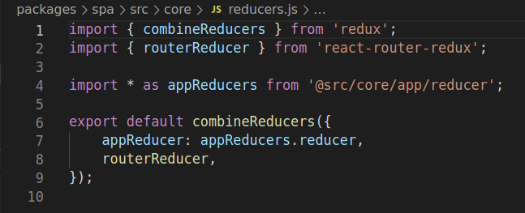

## ¿Cómo se conectan las acciones con los reducers y sagas?
Cuando se inicializa nuestro Provider.js se encarga de registrar todos los reducers y sagas de nuestra aplicación que estén importados en sus respectivos ficheros del root (src/core/reducers.js y src/core/sagas.js). En cada uno de estos ficheros importamos cada saga.js ó reducer.js que tiene nuestra aplicación para poder crear los watcher al renderizar la primera vez.

#### Ejemplo del reducer.js del root.


Importamos de los módulos dentro de **src/core/** todas los reducer.js al igual hacemos algo parecido con las sagas.

Con esto ya está preparada la app para que al lanzar una acción, si existe alguna saga que escuche a esa acción entonces se ejecutará y en el caso que la acción enviada no esté en una saga pero sí en un reducer.js entonces generará el nuevo estado de la aplicación haciendo el merge entre el estado actual con lo enviado en el payload de la acción.

## He creado una acción nueva, cómo creo una saga que intercepte esa acción?
Supongamos que estamos creando un nuevo módulo y queremos que tenga sus acciones, reducer y sagas para cargar el header y sus datos (logo, menu, etc..).

Una vez creado el directorio **header** dentro de **src/core**, creamos nuestros 3 ficheros (reducer.js, saga.js y actions.js)

1. Creamos nuestra acción dentro de **actions.js**

```javascript {2}
export const loadHeader = () => ({
    type: LOAD_HEADER,  // Recuerda crear esta constante en constants/actions.js
    payload: {},        // Para cargar el header no necesitamos ejecutar la accion con parametros. Asi que el payload lo dejamos vacio
});
```

2. Creamos la saga dentro de **saga.js**

```javascript {2}
export function* loadHeader() {
    yield take(LOAD_HEADER);  //Fijese que con esto escuchamos cuando se ejecute alguna acción que en el type tenga el mismo valor (LOAD_HEADER) de esta forma cuando llamamos nuestra acción la interceptamos en la saga.

    try {
        const headerResponse = yield call(mobilisAPI.header);  // Hacemos la petición ajax y guardamos la respuesta en una variable

        yield put({  // Ejecutamos otra acción (Efecto secundario) para guardar la respuesta en el store
            type: SAVE_HEADER_RESPONSE,  // Esta acción no tiene ninguna saga asociada pero está mapeada dentro de nuestro reducer.js
            payload: {
                header: headerResponse,
            },
        });
    } catch (error) {
        /** Si el ajax fallara, ejecutamos otra acción que no tiene saga
         *  pero está en el reducer y generamos un estado nuevo asignando 
         * como null las props del header (Suponiendo que si falla queremos 
         * dejarlo como null para que quede el loader eternamente) 
         * **/
        yield put({  
            type: SAVE_HEADER_RESPONSE_FAILED,
            payload: {
                header: null,
            },
        });
    }
}
```
<a name="how-register-a-saga"></a>

:::caution
Por motivos de cómo funciona redux-saga, cuando creamos una saga debemos exportarla junto a un par de metodos de redux, de esta forma cuando importemos el fichero en el saga.js del root, se registrará correctamente.
:::

Un ejemplo para exportar la saga que acabamos de crear, seria en el mismo fichero:

```javascript
export default function* root() {
    yield all([
        fork(loadHeader),
        fork(watchActions),  // Metodo definido abajo
    ]);
}

export function* watchActions() {
    // Esto es sólo si queremos enviar la misma acción varias veces en diferentes puntos de la app.
    // Quiza el header no es el mejor ejemplo para mostrar esto, pero es solo por demostrar como funciona.
    // Header lo solemos cargar una sola vez, pero una acción como solicitar una disponibilidad de habitaciones
    // podriamos deducir que podria ocurrir multiple veces (un usuario jugando con las fechas y comparando precios)
    // Esa misma acción necesitara que cada vez que se ejecute, llame a su saga, para eso debemos agregar el
    // takeEvery.
    yield takeEvery(LOAD_HEADER, loadHeader);
}
```
3. Creamos nuestro reducer dentro de **reducer.js**


```javascript
import {
    SAVE_HEADER_RESPONSE,
    SAVE_HEADER_RESPONSE_FAILED,
} from '@src/constants/actions';

import { reducer as helperReducer } from '@src/helpers/reducer';

module.exports = {
    reducer,
};

// Configuramos nuestro estado inicial para este reducer
const initialState = {
    header: null,
};

const reducerMap = [  // Aqui mapeamos cuales acciones permiten modificar el estado de este reducer (initialState)
    SAVE_HEADER_RESPONSE,
    SAVE_HEADER_RESPONSE_FAILED,
];

function reducer(state = initialState, action) {
    // Si la acción está dentro de la variable reducerMap
    // entonces lo marcamos como valido
    const isValidAction = reducerMap.indexOf(action.type) !== -1;
    
    // Si la acción es valida mergeamos, sino devolvemos el estado actual.
    return isValidAction ? { ...state, ...action.payload } : state;
}
```

## Al llamar a una acción no se ejecuta la saga
Esto puede ser por varios motivos:
* Empieza comprobando que estas exportando correctamente tu saga.[Recuerda que debes exportarla](#how-register-a-saga)

* Comprueba que tu saga tiene el **take** y estás usando el mismo nombre de acción que la propia acción.

* Si es una acción que se repite más de una vez, recuerda que al exportarla debes usar tanto el take como el takeEvery, el uso de ambas permite que una acción que se dispara más de una vez que su saga se ejecute el mismo número de veces.