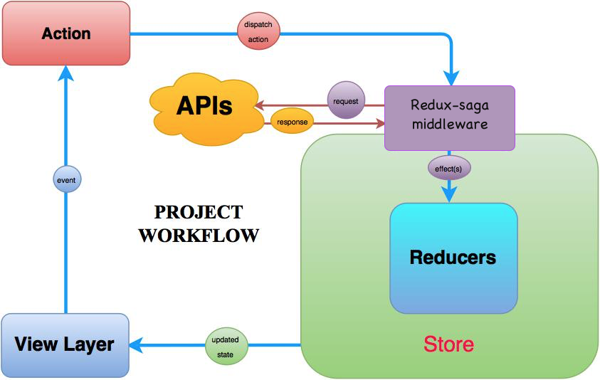

Antes de entender cada parte del proyecto, necesitamos comprender el flujo en una aplicación SPA usando ReactJS y Redux.

Partimos del siguiente gráfico:



## Introducción
Basándonos en el gráfico anterior, lo primero que debemos entender es que **TODO** en la aplicación sucede gracias a una acción que fue disparada por algun evento o acción del usuario.

Cuando el componente de SPA es renderizado lo primero que cargaremos será nuestro **Provider.js**. Ya que es el responsable de cargar las urls, reducers y sagas de nuestra aplicación.

Una vez el Provider es renderizado, la libreria de **react-router-dom** comprobará la url a la que estamos accediendo e intentará cargar el contenedor correspondiente (La resulución de urls la hace el front ahora).

Una vez que el contenedor está renderizado, podriamos decir que nos encontramos en la capa **View Layer** del gráfico.

### Explicamos el flujo del gráfico (Partiendo de **View Layer**)
#### Action

A partir de aqui, si queremos navegar a otra página (redirección), solicitar o enviar una petición via AJAX, etc... Será mediante una acción. Esta acción es una prop (callback) de nuestro contenedor. Este punto sería el evento.

#### Dispatch action
Una vez ejecutada nuestro callback, se disparará la accion junto a su payload.

#### Redux saga - Middleware
Si hay alguna saga que esté escuchando esa acción que hemos ejecutado, la interceptará y podrá acceder al payload.
En este punto es donde se accederá a una API, enviaremos un ajax, etc... y con la respuesta de esa petición, la guardaremos en el estado ó ejecutaremos otra acción (Efecto secundario) enviandole la respuesta para que sea procesada o lo que tengamos que hacer con la información.

:::tip
Cuando queremos guardar en el store el resultado de nuestra petición AJAX, debemos ejecutar otra acción (Efecto secundario)
:::


:::tip
Recuerda diferenciar los nombres de las acciones entra tu saga y reducer.

Una buena practica cuando tienes que hacer una petición AJAX y guardar el resultado en el store pordría ser tener una acción que será interceptada por nuestra saga (**FETCH_PETICION1**) donde haremos el ajax y guardaremos el resultado en una variable, para ejecutar un efecto secundario, es decir, otra acción (**SAVE_RESPONSE_PETICION1**) donde le enviaremos en el payload el resultado de la petición.

Esta secunda acción, no tendrá ninguna saga, sólo estará mapeada en nuestro reducer.js, de esta forma, cuando responda el ajax, se envia esa acción adicional y que lo guardará en el estado y rehidratará nuestro contenedor (Si el contenedor está escuchando ese estado)
:::

### Reducers
Si nuestra saga llama a otra acción que esté mapeada dentro de nuestro reducer.js, entonces el reducers leerá lo que hemos enviado en el payload y creará un nuevo estado de la aplicación

:::tip
El reducer nunca modifica el estado, el estado es inmutable. Por lo que siempre hace un merge entre el estado actual y el objeto que enviamos en el payload. Es importante que el payload siempre tenga la misma estructura que la parte del estado que queremos modificar, sino duplicará la información y no se hidratará la aplicación correctamente.
:::

### Updated state
Una vez que el reducer devuelve el objeto que contiene el nuevo estado de la aplicación se rehidrata el contenedor.


## Conceptos básicos y responsabilidades

### * Store
El store es nuestra fuente de la verdad, es donde almacenamos todo el estado de la aplicación. Normalmente tenemos un store para toda la aplicación y dentro del mismo store podemos definir como agrupar los valores del estado.

### * Containers
Cada contenedor representa a una página o sección de nuestra aplicación.

#### Responsabilidades de los contenedores
Cada contenedor deberá:
  * Escuchar el ó los estados que realmente necesita esa página.
  * Importar un helper que recibirá las props y devolverá todos los datos que necesita el componente página para ser renderizado.

Por cada contenedor tendremos un fichero donde conectamos a nuestro contenedor con el store y leemos diferentes partes del estado de la aplicación.

Este fichero es el que usamos para registrar un contendor a una url.

### * Acción
Una acción representa un evento en nuestra aplicación. Cada acción puede desencadenar otras acciones (efectos secundarios)
Las acciones son funciones puras, es decir, no deben poseer ninguna lógica, calculos, condicionales, etc.. 

:::important
Las acciones describen que algo pasó
:::
#### Anatomia de una acción
Cada acción sólo deberá devolver un objeto que describe a la acción que se quiere enviar. 
El objeto debe tener 2 keys:
* **Type**: Aqui importamos una constante que contiene el nombre único para esta acción (No pueden haber dos o más acciones con el mismo nombre)
* **Payload**: Si la acción recibe parametros de entrada debemos devolverlos dentro de la key payload, en caso que no reciba parámetros devolveremos siempre el payload como un objeto vacio.

```javascript
export const loadShoppingCart = (forcedType = 'fixed') => ({
    type: LOAD_SHOPPING_CART,
    payload: {
        forcedType,
    },
});
```
En este caso recibimos por parametro el **forcedType** y nuestra acción lo devuelve tal cual en el payload junto al **type** que seria un nombre único para la acción.


### * Reducers
Los reducers son los únicos que pueden generar un "cambio" de estado en la aplicación y son llamados por las acciones.

El estado de nuestra aplicación es un objeto que podemos segmentarlo como queramos. es una buena práctica tener un reducer por cada modulo ó sección de la aplicación. De tal manera que podremos gestionar el estado en pequeños módulos.

:::important
Las acciones describen que algo pasó, pero no especifican cómo cambió el estado de la aplicación en respuesta. Esto es trabajo de los reducers.
:::

La función del reducer es devolver un nuevo objeto con el estado actual de la aplicación.

### * Sagas
Las sagas es donde ocurre la magia de la aplicación, aqui es donde hacemos peticiones AJAX para enviar o recuperar datos y definimos el comportamiento de la aplicación mediante la ejecución de más acciones ó efectos secundarios.

Las sagas son llamadas mediante las acciones. Cada saga se encuentra a la escucha de las acciones que llamemos en la aplicación de esa manera interceptan el nombre de la acción y se ejecutan si coincide con la acción llamada.

Podemos acceder al estado desde una saga mediante los selectores.

### * Selectores
Los selectores son funciones que reciben como parametro el estado de la aplicación, retornan el estado o una parte de él. Se utilizan para acceder al estado de la aplicación desde una saga.

### * Midlewares
Los middlewares se ejecutan entre acciones y permiten tener cierto control sobre ellas, saber cuando una acción ha fallado, etc..