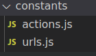

Aqui gestionaremos todas las constantes de la aplicación.

## Skeletons
En este directorio tendremos los SVG que usaremos como skeleton en los contenedores.

## actions.js
En este fichero guardaremos todos los nombres de acciones de nuestra aplicación, de esta forma nos aseguramos que no podremos crear nombres duplicados.

#### Ejemplo de una acción
```javascript
export const LOAD_SHOPPING_CART = 'LOAD_SHOPPING_CART';
```

:::important
Notese que los nombre de las variables son iguales al valor, de esta forma donde queramos registrar o lanzar la acción, importaremos el nombre siempre desde este fichero.
:::

## datesFormat.js
Cuando queramos usar moment o formatear las fechas, siempre debemos importar el formato desde este fichero para mantenerlo unificado.

## errorCodes.js
Gestión de códigos de error internos. 

Es utilizado para peticiones ajax donde el CRS devuelve un código de error (026, 011, etc...). Asi podemos saber el motivo del error y mostrar un mensaje u otro.

## urls.js
Aqui gestionamos las urls para los contenedores. Cuando agregamos un nuevo contenedor debemos asignarle una url.

#### Ejemplo de url usando react-router-dom

```javascript
export const ROOMS_AVAILABILITY_URL = '/:lang?/bookcore/availability/rooms/:hotelCode/';
```

Url para la disponibilidad de habitaciones. Recibe 1 parámetro opcional (lang) y uno obligatorio (hotelCode).

El parámetro lang lo usamos para los proyectos que gestionan los idiomas en el path de la url (www.blauhotels.com/en/)