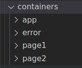
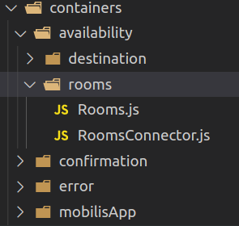
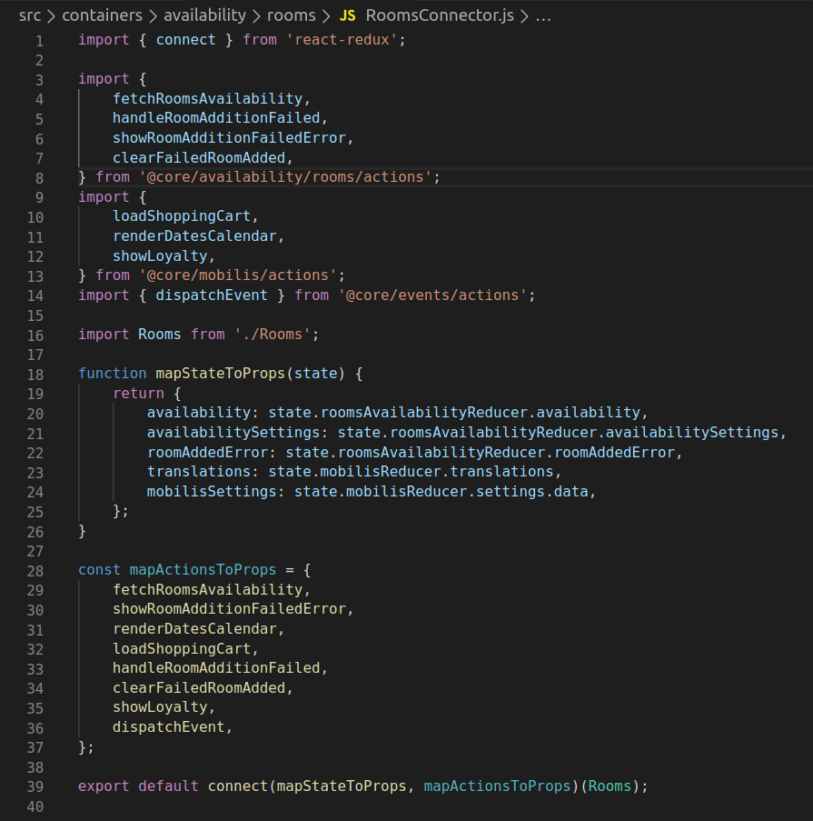

Los contenedores como hablamos al principio, son las diferentes páginas o secciones que tiene nuestra aplicación.

Cada contenedor tendrá dos ficheros, uno donde cargaremos el componente página, construiremos las props de dicha página y lo renderizamos. Y el otro fichero será donde conectaremos nuestro contenedor con el store y acciones.

### Ejemplo del contenedor de home

#### RoomsConnector.js

Explicaremos brevemente lo que debe hacer nuestro conector.

| Lineas del fichero         |     Descripción|   
| :-----------: | :-----------: |
| 1             | Importamos desde la libreria de react-redux el metodo connect |
| 3 a 8         | Importamos las acciones que pertenecen a nuestro contenedor de disponibilidad de habitaciones( **src/core/availability/rooms/actions.js**) |
| 9 a 13      |   Importamos acciones que están en el módulo "global" de la app (Mobilis -> **src/core/mobilis/actions.js**)    |
| 14 |  Importamos más acciones. En este caso para enviar eventos a GTM    |
| 16 |  Importamos nuestro contenedor    |
| 18 a 26 |  Creamos una funcion que nos llega por parametro todo el estado de nuestra aplicación y aqui devolvemos un objeto con sólo las parte del estado que queremos utilizar en nuestro contenedor.    |
| 28 a 36 |  Creamos un objeto donde registramos las acciones que previamente importamos    |
| 39 |  Usamos la función connect donde registramos nuestro contenedor y le enviamos tanto los estados cómo las acciones y lo exportamos.    |

:::important
Fijese que tanto la función de la linea 18 como el objeto de la linea 28, ambos los nombre de las variables usamos la nomenclatura **mapXXToProps**

Esto se debe a que en nuestro contenedor, podremos acceder a los estados y acciones como si fuesen props.

es decir:

**this.props.redirectTo**: Seria la acción que usaremos para redirigir el usuario a una nueva url.
