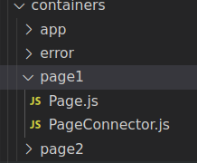
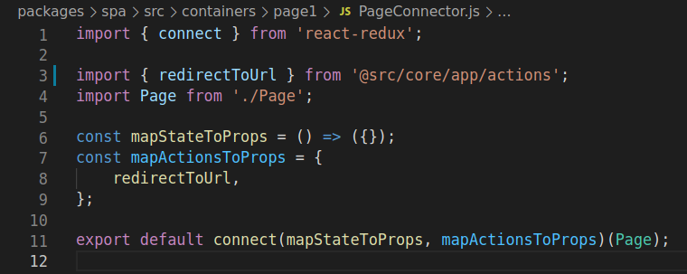

Los contenedores como hablamos al principio, son las diferentes páginas o secciones que tiene nuestra aplicación.

Cada contenedor tendrá dos ficheros, uno donde cargaremos el componente página, construiremos las props de dicha página y lo renderizamos. Y el otro fichero será donde conectaremos nuestro contenedor con el store y acciones.

### Ejemplo del contenedor de page1

#### PageConnector.js

Explicaremos brevemente lo que debe hacer nuestro conector.

| Lineas del fichero         |     Descripción|
| :-----------: | :-----------: |
| 1             | Importamos desde la libreria de react-redux el metodo connect |
| 3          | Importamos las acciones que usaremos en el contenedor de `Page1` ( **src/core/app/actions.js**) |
| 4 |  Importamos nuestro contenedor (Componente de React)    |
| 6 |  Creamos una funcion que nos llega por parametro todo el estado de nuestra aplicación y aqui devolvemos un objeto con sólo las parte del estado que queremos utilizar en nuestro contenedor.    |
| 7 |  Creamos un objeto donde registramos las acciones que previamente importamos para enviarlas al componente como props    |
| 11 |  Usamos la función connect donde registramos nuestro contenedor y le enviamos tanto los estados cómo las acciones y lo exportamos.    |

:::important
Fijese que tanto la función de la linea 6 como el objeto de la linea 7, ambos los nombre de las variables usamos la nomenclatura **mapXXToProps** ya que son las props que recibirá nuestro componente.

Esto se debe a que en nuestro contenedor, podremos acceder a los estados y acciones como si fuesen props.

es decir:

**this.props.redirectTo**: Seria la acción que usaremos para redirigir el usuario a una nueva url.
