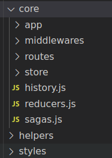

En este apartado explicaremos las diferentes partes que conforman nuestro core.

No lo explicaré en orden que aparece en la imagen, ya que intentaré explicar los ficheros clave y luego veremos que el patrón lo repetimos por cada módulo.

## history.js
En este fichero es donde creamos el historico de la aplicación para poder controlar el ir hacia atrás, redirigir a una nueva url, etc...

Este fichero inicialmente es utilizado por el Provider.js para construir un historico y enviarlo al resto de contenedores para que usemos la misma instancia.

Tambien expone un método **getHistory()** que lo usamos para obtener esa instancia creada y poder sacar información de la url actual, redirigir, etc...

## reducer.js

En este fichero registramos los diferentes reducers de nuestra aplicación. De esta forma ya están a la escucha de nuestras acciones para saber cuando generar un estado nuevo y actualizar la aplicación.

:::important
El store guarda el estado de toda tu aplicación, pero puedes divir ese objeto por "reducers". Cada contenedor debería tener su propio reducer.
:::

## sagas.js

En este fichero registramos todas nuestras sagas para que al lanzar una acción, si tenemos una saga que intercepta el nombre de esa acción se pueda ejecutar antes de pasar por el reducer.

:::important
Cada contenedor deberá tener su propio fichero sagas.js que luego importaremos en este saga.js del root.
:::

## store
En este módulo gestionamos el store de la aplicación y asignamos ciertos middlewares.

Cuando estamos en un entorno de desarrollo, al store se le incluye un middleware para que en la consola del navegador, si tienes instalado el plugin de REDUX, puedas ver el store, las acciones que se envian y mucha más información.

## selectors
Aqui gestionamos los selectores de nuestra aplicación que utilizaremos en las sagas.

Tendremos un fichero por cada módulo, asi tenemos separado el acceso a las diferentes partes del estado.

## routes
En este fichero gestionamos todo el mapeo de los contenedores y las urls a la cual pertenecen.
Este fichero es cargado por el Provider.js
También construye ciertas props según el container.

## middlewares
Aqui gestionamos los diferentes middleware que se ejecutarán entre acciones.

:::important
Si creamos nuevos middleware debemos recordar de inicializarlos en el store.
:::

## Todo lo demás
Para todos los otros directorios, como por ejemplo:
* app

Son simplemente módulos de los contenedores donde contienen 3 ficheros:
* **actions.js**: Aqui creamos las acciones únicas para ese contenedor
* **reducers.js**: Aqui mapeamos cuales acciones permiten modificar el estado

:::important
Recuerda que **NO** todas las acciones modifican el estado directamente. A veces nos interesa lanzar una acción que accede a una api y según la respuesta lanza una acción u otra ó guarda la respuesta en el estado.
En el reducers.js sólo debemos asignar las acciones que queremos que modifiquen el estado directamente.
:::
* **sagas.js**: Si al lanzar una acción hay cierta lógica, acceso a apis, ajax, etc.. le asignamos una saga a esa acción.