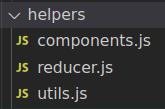
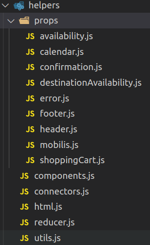

En este directorio tiene las siguientes responsabilidades:

* Unificamos métodos genericos o que pueden ser reutilizados en diferentes partes de la aplicación

* Construir las props de cada contenedor

### props

En este directorio gestionamos la construcción de props para los contenedores. Se suele dividir por módulos (Header, Footer, contenedor1, contenedor2, etc...)

### components
Aqui gestionamos los métodos necesarios para renderizar de forma lazy los componentes.

### connectors
A veces cuando conectamos un estado a un contenedor necesitamos devolver otro valor según el estado y queremos hacerlo en el conector para que al container le llegue el valor real que necesita. Con este fichero exportamos metodos que nos permiten pasarle el estado desde el conector y devolver lo que nos interesa.

### html
Hack para poder renderizar HTML que nos llega en un ajax (Bono de confirmación)

### reducer
Aqui gestionamos ciertos metodos que nos permiten ejecutar el reducer si la accion es valida

### utils
Funciones genéricas reutilizables en toda la app.